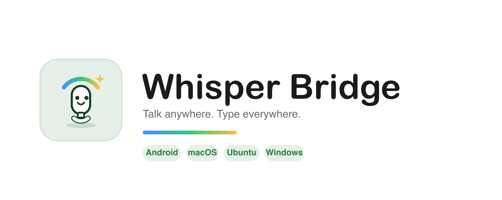
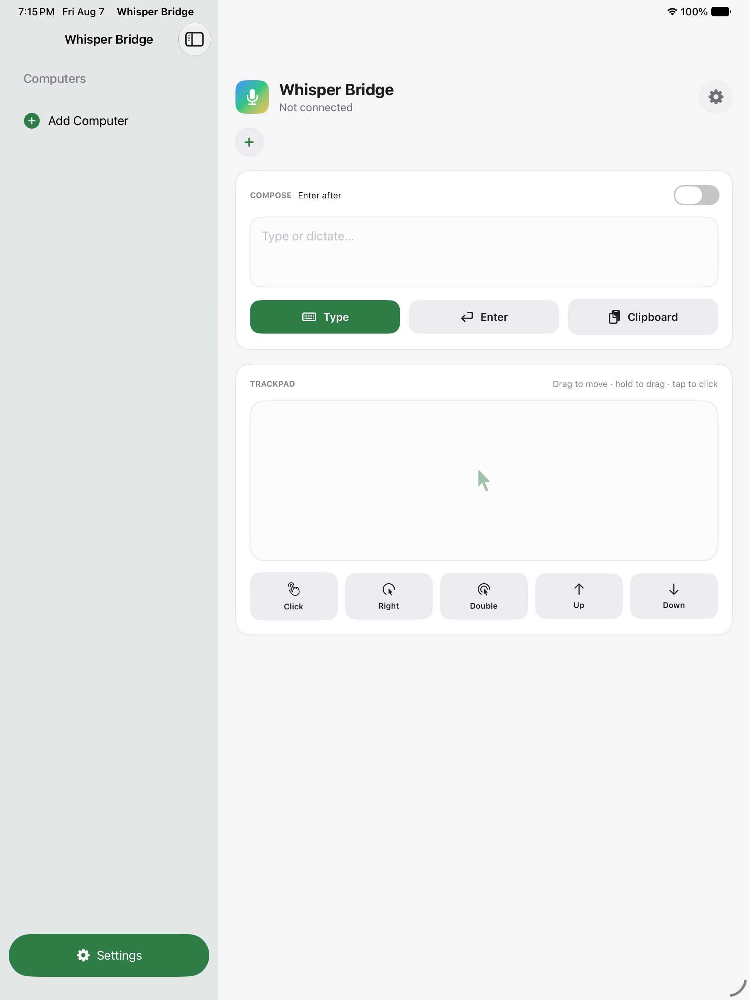
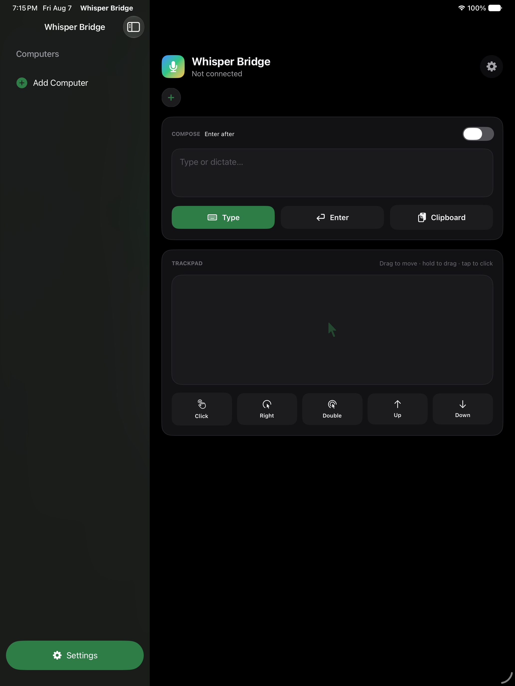
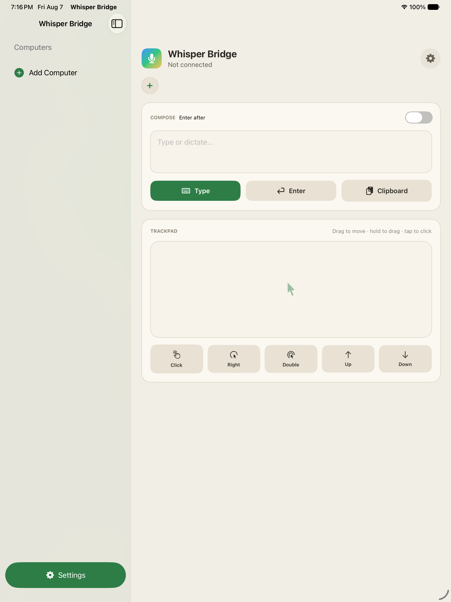
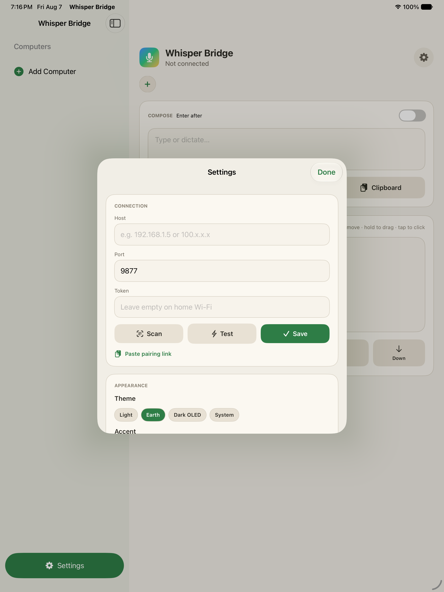
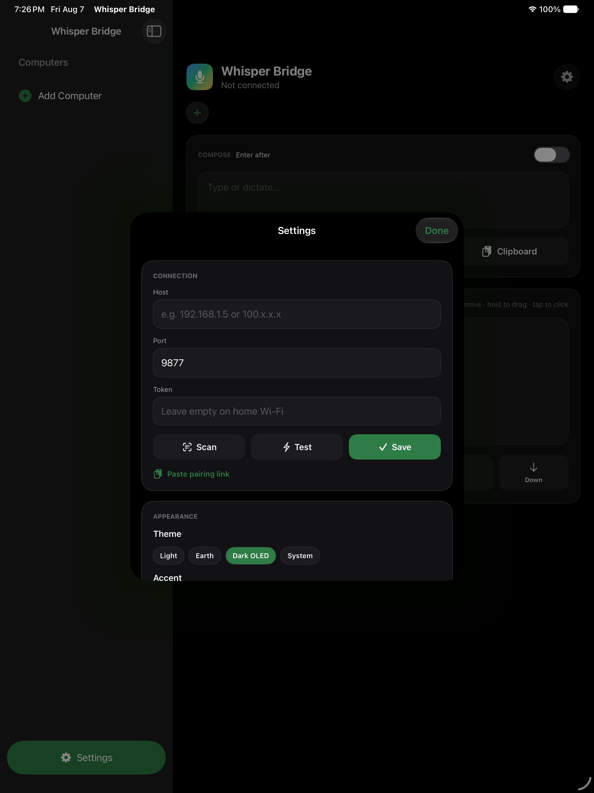

<p align="center">
  
</p>

<p align="center"><b>Talk into Wispr Flow on your Android phone, then send the text to the focused field on your Mac, Ubuntu, or Windows computer.</b></p>

> **Unofficial project:** Whisper Bridge is an independent open-source companion for Wispr Flow. It is not affiliated with, endorsed by, or sponsored by Wispr Flow, Tailscale, Microsoft, Canonical, or Apple. Wispr Flow is a trademark of its respective owner.

The desktop receiver supports macOS, Ubuntu, and Windows. See [Privacy](PRIVACY.md) and [Security](SECURITY.md) before installing.

## Quick Start

1. Download the signed Android APK and your computer's ZIP from [Releases](https://github.com/BrandonKNguyen192/whisperflow-bridge/releases).
2. Install the desktop receiver using `mac-server/install.command`, `ubuntu-server/install.sh`, or `windows-server/install.ps1`.
3. Open the local console at `http://localhost:9877` and scan its pairing QR from Android settings.
4. Share text from Wispr Flow to Whisper Bridge, choose the destination profile, and tap **Type**.

An iOS/iPadOS app is in development in `ios-app/` (see `documentation/ios-plan.md`).

## Screenshots

| iPhone / iPad app | |
| --- | --- |
| Light |  |
| Dark OLED |  |
| Earth |  |
| Settings · Earth |  |
| Settings · Dark OLED |  |

```
┌──────────────┐   WiFi / LAN / Tailscale   ┌──────────────┐
│   Android     │  ──── HTTP POST ────►     │   Computer    │
│  Wispr Flow   │   application/json        │   receiver    │
│  → Share →    │                           │  → ⌘V paste   │
│  Bridge App   │                           │  → clipboard  │
└──────────────┘                            └──────────────┘
```

## Features ✨

- **Multi-profile switching** — toggle between Mac, Ubuntu, and Windows computers with one-tap profile chips
- **Theme system** — Light, Pure OLED Black (#000), and System modes. Choose a preset or any RGB accent color
- **Enter/Return button** — separate button that sends a Return keypress
- **Enter-after-type** — optional checkbox to auto-press Enter after pasting
- **Pair by QR** — scan a QR code from the desktop console to auto-fill connection details
- **Four modes** — Type (paste), Clipboard (copy only), Append (add to existing clipboard), and Enter (Return key)
- **Remote via Tailscale** — works anywhere, not just on your home WiFi. Token-based auth
- **Login item** — `--install-login` makes it launch at boot and stay alive
- **Share sheet integration** — preview and confirm text shared from Wispr Flow
- **Floating overlay** — status pill on your Mac desktop showing live dictation feedback

## How It Works

1. **Speak** into Wispr Flow on your Android phone → transcribed text appears
2. **Share** → **Whisper Bridge** (or open the app and type/paste)
3. The bridge app sends the text over Wi-Fi/LAN or Tailscale to the selected receiver
4. The receiver pastes it into the focused text field, or copies it to the clipboard

## Setup

### 1. Desktop Receiver

**macOS:** extract the Mac ZIP and double-click `mac-server/install.command`. Python 3 is required; the installer opens Accessibility settings and creates a durable LaunchAgent.

**Ubuntu:** extract the Ubuntu ZIP and run `./ubuntu-server/install.sh`. It installs the Wayland/X11 input helpers and creates a user-level systemd service.

**Windows:** extract the Windows ZIP and run `windows-server\install.ps1` from PowerShell. Python 3 is required; allow Python through Windows Firewall only on Private networks.

Then open **http://localhost:9877** in a browser to pair the Android app.

**Options:**
```bash
python3 launch.py --install-login   # run at boot, stay alive (recommended)
python3 launch.py --port 8080                       # custom port
python3 launch.py --no-sound                        # disable the chime
python3 launch.py --uninstall-login                 # remove login item
```

**Test it:**
```bash
curl -X POST http://localhost:9877/send \
  -H 'Content-Type: application/json' \
  -H "Authorization: Bearer $(cat ~/.config/whisperbridge/token)" \
  -d '{"text": "Hello from the terminal!", "mode": "type"}'
```

### 2. Android App

**Download the APK** from [GitHub Releases](https://github.com/BrandonKNguyen192/whisperflow-bridge/releases) and install it on your phone. You'll need to allow "Install from unknown sources" in Android Settings. Verify the download with:
```bash
shasum -a 256 app-release.apk
```

**To build from source:** Open the `android-app/` folder in Android Studio, sync Gradle, and Run. Requires JDK 17 and SDK 34.

**First launch:** Open Whisper Bridge → tap the gear → scan the receiver QR, or enter its details:
- **Host:** the computer's LAN or Tailscale IP
- **Port:** `9877` (default)
- **Token:** the secret stored at `~/.config/whisperbridge/token`
- Tap **Test** to verify the connection

Each QR carries a destination name, so Android can switch between Mac, Ubuntu, and Windows profiles.

### 3. Use It

**From the app:**
1. Type or paste text → tap **Type**, **Enter**, or **Clipboard**

**From Whisper Flow:**
1. Transcribe your speech in Wispr Flow
2. Tap the **Share** button (⋮ or share icon)
3. Choose **Whisper Bridge** from the share sheet
4. Review the preview and tap **Type**

**Manual entry:**
1. Open the Whisper Bridge app
2. Type or paste text
3. Tap **Type**, **Enter**, or **Clipboard**

## Modes

| Mode | What it does |
|------|-------------|
| **Type** (default) | Copies text to the desktop clipboard, then pastes into the focused app |
| **Enter** | Sends a Return/Enter keypress (no text) |
| **Clipboard** | Copies text to the selected computer's clipboard only — you paste manually |
| **Append** | Appends to existing clipboard content with a newline |

## Android App Features

### Settings (gear icon ⚙️)
- **Connection** — Host IP, Port, Token, Scan QR, and Test button
- **Appearance** — Theme (Light / Dark OLED / System), eight curated accents, and a custom RGB color picker

### Profile switcher
Tap the profile chips at the top to switch between computers. Long-press to delete. Each profile stores its own host, port, and token.

### Theme
- **Light** — warm off-white canvas with sage accents
- **Dark OLED** — pure black (#000000) background for power savings on OLED screens
- **System** — follows your phone's dark mode setting

## Remote Use (Tailscale)

The same receiver works away from home without port forwarding.

1. Install **Tailscale** on the computer and Android phone; sign in with the same account.
2. Open the local receiver console and select the Tailscale QR.
3. Scan it from Android settings. A unique token gates `/send` and the web console.
4. In the app, put the tailnet address in **Host** and the same secret in **Token**, then tap **Test** — it verifies the token too.

Why this is safe: Tailscale's WireGuard tunnel is encrypted end‑to‑end, so plain HTTP inside it is fine.

**⚠️ Important:** On a plain LAN (without Tailscale), the token and every dictated character travel in the clear and are readable by anything else on that Wi‑Fi. Use Tailscale whenever you're not on a trusted home network. The server already listens on `0.0.0.0`, so one running instance serves your LAN *and* your tailnet at once — at home use the LAN IP, away use the tailnet address. Keep Tailscale **Funnel** *off*; Funnel would publish the port to the public internet.

```bash
# from anywhere on your tailnet
curl -H "Authorization: Bearer $(cat ~/.config/whisperbridge/token)" -H 'Content-Type: application/json' \
  -d '{"text": "dictated from a coffee shop", "mode": "type"}' \
  http://<tailnet-ip>:9877/send
```

## Menu Bar App (always-on, launches at login)

`menubar.py` runs the bridge in the background and puts a 🎙 status item in your menu bar showing the live **LAN** and **Tailscale** addresses, the token state, and the last dictation — with one-click *Open console*, *Copy pairing link*, and *Quit*. The `launch.py` script is recommended for most users since it includes the floating overlay.

```bash
pip3 install rumps            # one-time; pulls PyObjC for the menu bar
python3 mac-server/menubar.py
```

## Troubleshooting

- **"Connection failed"** — Make sure both devices are on the same Wi-Fi or tailnet and the desktop receiver is running.
- **Text doesn't appear** — macOS Accessibility permission is required. Go to System Settings → Privacy & Security → Accessibility and enable your terminal app.
- **Firewall blocking** — Allow Python/Whisper Bridge on trusted Private networks only.
- **Share sheet doesn't show Whisper Bridge** — Reinstall the app, or look under "More" in the share sheet.
- **Enter shows HTTP 400** — Update the Mac server and restart its login item with `python3 launch.py --install-login`.

## Project Structure

```
Whisperflow Bridge/               ← this repo
├── common/                    # Authenticated HTTP protocol and shared runtime
├── mac-server/
│   ├── server.py              # Compatibility entry point
│   ├── launch.py              # Convenience launcher: server + overlay + login item
│   ├── overlay.py             # Floating status pill (tkinter)
│   └── menubar.py             # Menu-bar app + login item (needs `rumps`)
├── ubuntu-server/             # Wayland/X11 backend and systemd installer
├── windows-server/            # PowerShell/SendKeys backend and startup installer
├── android-app/               # Android Studio project
│   ├── app/src/main/java/com/whisperbridge/
│   │   ├── MainActivity.kt           # Multi-profile UI + settings + theme picker
│   │   ├── ShareReceiverActivity.kt  # Share sheet receiver
│   │   ├── ScanActivity.kt           # In-app QR scanner (ZXing)
│   │   ├── ProfileManager.kt         # Multi-profile storage
│   │   ├── ThemeManager.kt           # Light / Dark OLED / System + accent colors
│   │   ├── Pairing.kt                # Parses QR / deep link URLs
│   │   └── BridgeClient.kt           # HTTP client (type, clipboard, append, enter)
│   └── res/                          # Layouts, colors, icons, drawables, themes
├── DESIGN.md                    # Komodos design language reference
├── LICENSE                      # MIT
└── README.md
```

## License

MIT — use it, fork it, ship it. See [LICENSE](LICENSE).
